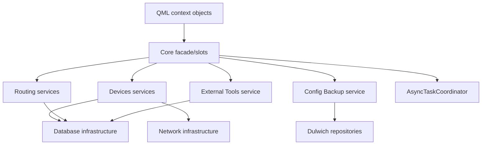

# Kế hoạch tách `core/runtime.py` và `core/database.py` theo trách nhiệm

> Trạng thái triển khai 2026-07-20: đã hoàn tất các giai đoạn 1-3, tách đầy đủ package/mixin của giai đoạn 5, loại đường backup legacy ở giai đoạn 8 và phần validator/tài liệu của giai đoạn 9. `core/database/manager.py` hiện chỉ composition, signal và health slot. Giai đoạn 4 mới chuyển facade External Tools khỏi runtime; giai đoạn 6-7 còn phải chuyển SQL trong các mixin Devices và Routing/View-Push xuống feature service/repository. Các phần chưa hoàn tất được giữ nguyên hành vi, không xóa/viết lại vội.

## 1. Thông tin cơ sở

- Repository: `ntdatphu/CAMS`
- Commit dùng để khảo sát: [`bd8a23f72701ee2f34893f705c05e1f22c59b212`](https://github.com/ntdatphu/CAMS/commit/bd8a23f72701ee2f34893f705c05e1f22c59b212)
- Phạm vi: thư mục `app/`, tập trung vào:
  - `app/core/runtime.py`: khoảng 2.387 dòng.
  - `app/core/database.py`: khoảng 1.077 dòng.
- Mục tiêu: tách theo trách nhiệm, giữ nguyên hành vi và contract QML hiện tại.
- Ngoài phạm vi giai đoạn đầu:
  - Không đổi layout QML.
  - Không đổi schema SQLite.
  - Không đổi tên context property như `dbManager`, `cli`, `externalTools`.
  - Không đổi kết quả trả về, tên signal hoặc chữ ký `@pyqtSlot`.
  - Không viết lại nghiệp vụ Dulwich đã có trong `features/config_backup/`.

## 2. Kết luận khảo sát hiện trạng

### 2.1. `core/runtime.py`

File hiện đồng thời chịu các trách nhiệm sau:

1. Khai báo path và hằng số toàn ứng dụng.
2. Đọc thông tin đăng nhập thiết bị trực tiếp từ SQLite.
3. Chuẩn hóa loại thiết bị.
4. Quản lý session SSH/Telnet.
5. Ping thiết bị.
6. Đọc RAM và thông tin mạng của hệ điều hành.
7. Mở terminal ngoài.
8. Cung cấp `AppPaths` cho QML.
9. Điều phối tác vụ nền trong `TerminalHelper`.
10. Chạy lệnh thiết bị, kết nối, đồng bộ và backup running-config.
11. Quản lý External Tools, phát hiện chương trình Windows và mở DB Browser.
12. Lưu trạng thái cửa sổ, theme và status bar.
13. Cung cấp `NetworkMonitor` cho QML.

Các vấn đề quan trọng:

- Có một class `DeviceSessionRegistry` cũ trong `runtime.py`, nhưng object toàn cục lại dùng `InfrastructureSessionRegistry`. Đây là code trùng/lỗi thời cần xác minh rồi loại bỏ.
- `TerminalHelper.closeDeviceSession()` tự khởi tạo `DatabaseManager` để cập nhật trạng thái thiết bị. Cách này tạo phụ thuộc ngược `runtime → database` và có nguy cơ vòng import, tạo thêm QObject/connection không cần thiết.
- `TerminalHelper` và `DatabaseManager` đều tự cài đặt cơ chế `QThread + BackgroundTask` gần giống nhau.
- Các file `core/settings.py`, `core/monitoring.py`, `core/sessions.py` hiện chủ yếu re-export implementation từ `runtime.py`; quyền sở hữu code vẫn chưa được chuyển thật sự.
- `ExternalToolsManager` quá lớn và trộn catalog, SQLite, Windows Registry, discovery, launcher và database browser.

### 2.2. `core/database.py`

File hiện đồng thời chịu các trách nhiệm sau:

1. QObject facade `DatabaseManager` và signal cho QML.
2. Điều phối tác vụ View & Push chạy nền.
3. Helper chuyển đổi `QVariant`, dict, list, int, bool và text.
4. Helper kết nối và kiểm tra SQLite.
5. Đọc JSON/XLSX và import thiết bị.
6. CRUD inventory thiết bị.
7. Quản lý trạng thái `success` và `dev`.
8. Tạo thư mục backup legacy và đọc file backup legacy.
9. Delegate lịch sử running-config sang `ConfigBackupService`.
10. Routing facade cho Static, OSPF và EIGRP.
11. View & Push facade cho Routing, DHCP và NAT.
12. Ghi thông tin YANG.
13. Kết hợp nhiều slot mixin: DHCP, ACL, NAT, Switching và stub.

Các vấn đề quan trọng:

- SQL CRUD thiết bị nằm trực tiếp trong QObject facade.
- Import JSON/XLSX, thao tác file và SQL nằm trong cùng class.
- `getRunningConfigBackup()` vẫn đọc đường dẫn legacy trong khi `ConfigBackupService` đã có migration.
- `createFoldersFromDevices()` tự tạo cấu trúc backup cũ, có thể xung đột với cấu trúc `backup/<host>/cfg` của Dulwich.
- `view_push.py` vẫn import `DB_PATH` và `device_session_registry` từ `runtime.py`, làm tăng coupling và rủi ro vòng import.
- `StubSlotsMixin` khai báo lại nhiều slot đã có implementation thật. MRO hiện che một phần stub, nhưng thiết kế này khó kiểm soát khi thêm feature.

## 3. Nguyên tắc refactor

1. **Tách theo trách nhiệm, không tách theo số dòng.**
2. **Giữ `core` là lớp QML facade/bridge mỏng.** Nghiệp vụ và SQL không được chuyển từ một file lớn sang nhiều file lớn khác trong `core` rồi dừng lại.
3. **Feature sở hữu nghiệp vụ.** Devices, Config Backup, Routing và External Tools tự sở hữu service/repository của mình.
4. **Infrastructure sở hữu adapter kỹ thuật.** SQLite connection, session mạng, system probe, Windows Registry và process launcher không thuộc QML facade.
5. **Giữ contract QML trong toàn bộ quá trình.** Tên slot, signal, payload và context property không đổi trong các commit di chuyển.
6. **Không tạo database infrastructure thứ hai trong `core/database/`.** Không tạo thêm `core/database/connection.py`, `paths.py` hoặc `schema.py` trùng với `infrastructure/database/`.
7. **Dependency injection thay cho tự khởi tạo chéo.** `TerminalHelper` không được tự tạo `DatabaseManager`; manager không được tự tìm dependency toàn cục nếu có thể truyền vào từ `main.py`.
8. **Mỗi commit chỉ di chuyển một nhóm trách nhiệm.** Commit di chuyển không đồng thời sửa nghiệp vụ.
9. **Compatibility shim có thời hạn.** `runtime.py` và `core.database.__init__` chỉ re-export tạm thời, sau đó consumer phải chuyển sang module chủ sở hữu.

## 4. Cấu trúc đích

```text
app/
├── core/
│   ├── __init__.py
│   ├── runtime.py                    # shim tương thích tạm thời
│   ├── app_paths.py                  # AppPaths và path UI công khai
│   ├── tasks.py                      # AsyncTaskCoordinator dùng chung
│   ├── terminal.py                   # TerminalHelper QML facade mỏng
│   ├── settings.py                   # Window/Theme/StatusBar QObject
│   ├── monitoring.py                 # NetworkMonitor QObject
│   ├── external_tools.py             # ExternalToolsManager QML facade mỏng
│   ├── config_backup_slots.py        # slot QML cho lịch sử running-config
│   ├── dhcp_slots.py
│   ├── acl_slots.py
│   ├── nat_slots.py
│   ├── switch_slots.py
│   └── database/
│       ├── __init__.py               # export DatabaseManager
│       ├── manager.py                # QObject facade và signal
│       ├── conversion.py             # chuyển đổi payload QML
│       ├── device_slots.py           # slot inventory/status
│       ├── device_import_slots.py    # slot import/export
│       ├── routing_slots.py          # slot Static/OSPF/EIGRP
│       ├── view_push_slots.py        # slot preview/push chung
│       ├── yang_slots.py             # slot YANG
│       └── unsupported_slots.py      # chỉ slot thực sự chưa hỗ trợ
│
├── features/
│   ├── devices/
│   │   ├── __init__.py
│   │   ├── models.py
│   │   ├── repository.py             # SQL t01_devices/t01_yangcfg
│   │   ├── service.py                # validation và use case inventory
│   │   ├── import_service.py         # JSON/XLSX và file mẫu
│   │   └── login_service.py          # dữ liệu đăng nhập đã chuẩn hóa
│   ├── config_backup/                # giữ feature Dulwich hiện tại
│   ├── routing/                      # giữ routing service hiện tại
│   └── external_tools/
│       ├── __init__.py
│       ├── models.py
│       ├── repository.py             # external_tools.db
│       ├── service.py                # catalog, validate, CRUD
│       ├── discovery.py              # điều phối discovery
│       └── launcher.py               # mở chương trình ngoài
│
└── infrastructure/
    ├── database/
    │   ├── connection.py
    │   ├── paths.py
    │   └── health.py                 # kiểm tra DB/schema bắt buộc
    ├── network/
    │   ├── device_connector.py
    │   ├── session_registry.py
    │   └── ping.py
    └── system/
        ├── process_launcher.py       # mở terminal/chương trình
        ├── resource_monitor.py       # RAM
        ├── network_info.py           # IP/interface/SSID
        └── windows_registry.py       # adapter Registry
```

## 5. Ánh xạ trách nhiệm của `core/runtime.py`

| Nội dung hiện tại | Nơi chuyển đến | Ghi chú |
|---|---|---|
| `APP_DIR`, `QML_MODULE_DIR`, `FEATURES_DIR` | `core/app_paths.py` | DB path tiếp tục lấy từ `infrastructure.database.paths` |
| `DB_PATH`, `SQL_PATH` | `infrastructure/database/paths.py` | Chỉ re-export tạm qua `runtime.py` |
| `normalize_device_type()` | `features/devices/login_service.py` | Đây là quy tắc nghiệp vụ kết nối thiết bị |
| `load_device_for_login()` | `features/devices/login_service.py` | Gọi `DeviceRepository`, không viết SQL trực tiếp |
| `is_dev_device()` | `features/devices/login_service.py` | Dùng model/DTO thống nhất |
| `update_device_flag()` | `features/devices/repository.py` | Không cho core chạy SQL trực tiếp |
| `open_terminal()` | `infrastructure/system/process_launcher.py` | Tách xử lý Windows/Linux/macOS |
| class `DeviceSessionRegistry` cũ | Xóa sau khi xác minh | Dùng duy nhất `infrastructure.network.session_registry.DeviceSessionRegistry` |
| `device_session_registry` toàn cục | Composition root trong `main.py` | Truyền vào `TerminalHelper`, tránh global ẩn |
| `_ping_probe_command()`, `ping_host()` | `infrastructure/network/ping.py` | Trả DTO/payload độc lập Qt nếu có thể |
| `read_ram_usage_percent()` | `infrastructure/system/resource_monitor.py` | `NetworkMonitor` chỉ gọi adapter |
| helper IP/interface/SSID | `infrastructure/system/network_info.py` | Gom code phụ thuộc OS vào một adapter |
| `AppPaths` | `core/app_paths.py` | QObject QML bridge |
| `TerminalHelper` | `core/terminal.py` | Chỉ slot/signal, ủy quyền service và task coordinator |
| Logic chạy lệnh/session | `TerminalHelper` + `infrastructure/network` | Core không tạo connector trực tiếp |
| Logic lưu running-config | `features/config_backup/service.py` | Terminal facade chỉ thu thập output và gọi service |
| Logic connect-and-sync | `features/devices/service.py` | Terminal facade phát signal từ kết quả service |
| `ExternalToolsManager` | `core/external_tools.py` + `features/external_tools/` | Core giữ QML API, feature giữ CRUD/discovery/launch |
| Windows Registry helper | `infrastructure/system/windows_registry.py` | Không đặt trong QObject |
| DB Browser helper | `infrastructure/database/browser/` | Tận dụng adapter đã có |
| `WindowSettings` | `core/settings.py` | Chuyển implementation thật, không re-export |
| `ThemeSettings` | `core/settings.py` | Giữ nguyên property và signal |
| `StatusBarSettings` | `core/settings.py` | Giữ nguyên key QSettings |
| `NetworkMonitor` | `core/monitoring.py` | Timer/QObject ở core, probe ở infrastructure |

### Trạng thái cuối của `runtime.py`

Trong giai đoạn tương thích:

```python
"""Compatibility imports; new code must import the owning module."""

from .app_paths import APP_DIR, FEATURES_DIR, QML_MODULE_DIR, AppPaths
from .external_tools import ExternalToolsManager
from .monitoring import NetworkMonitor
from .settings import StatusBarSettings, ThemeSettings, WindowSettings
from .terminal import TerminalHelper

__all__ = [
    "APP_DIR",
    "FEATURES_DIR",
    "QML_MODULE_DIR",
    "AppPaths",
    "ExternalToolsManager",
    "NetworkMonitor",
    "StatusBarSettings",
    "TerminalHelper",
    "ThemeSettings",
    "WindowSettings",
]
```

Sau khi `main.py`, `app_facade.py`, test và các feature không còn import `core.runtime`, xóa shim này.

## 6. Ánh xạ trách nhiệm của `core/database.py`

| Method/nhóm hiện tại | Nơi chuyển đến | Ghi chú |
|---|---|---|
| `DatabaseManager`, signal, `__init__` | `core/database/manager.py` | Chỉ composition và public QML contract |
| `_variant_list`, `_clean_display_text` | `core/database/conversion.py` | Helper thuần, có unit test |
| `_as_list`, `_as_dict`, `_int_or_none`, `_int_or_zero`, `_bool_int`, `_str_or_none`, `_dict_rows` | `core/database/conversion.py` | Không phụ thuộc QObject/SQLite |
| `_start_background_task` và relay signal | `core/tasks.py` | Dùng chung với `TerminalHelper` |
| `_connect` | `features/devices/repository.py` hoặc connection factory inject | Không tạo connection helper thứ hai trong core |
| `_ensure_column`, `_table_exists`, `_table_columns`, `initializeDatabase` | `infrastructure/database/health.py` | Schema chỉ do builder quản lý |
| `_file_url_to_path` | `core/database/device_import_slots.py` hoặc helper UI file URL | Chỉ chuyển QUrl/QML path |
| `_normalize_import_*`, `_read_json_import_rows`, `_read_xlsx_import_rows`, `_import_devices_from_path` | `features/devices/import_service.py` | Service không phụ thuộc QML |
| `addDevice`, `deleteDevice`, `updateDevice`, `getDeviceByHost`, `getDevices` | `core/database/device_slots.py` → `features/devices/service.py` | Slot chỉ chuyển payload và delegate |
| `updateDeviceSuccess`, `resetDeviceToWaiting`, `updateDeviceDev`, `setDeviceDevState` | `features/devices/service.py` | Dùng chung cho terminal/session, không qua DatabaseManager mới |
| `importDevicesFromFile`, `saveDeviceImportSample` | `core/database/device_import_slots.py` | Delegate `DeviceImportService` |
| `createFoldersFromDevices` | Loại bỏ hoặc chuyển migration vào `features/config_backup/service.py` | Không tạo folder legacy cho thiết bị chưa backup |
| `getRunningConfigBackup` | Deprecated rồi xóa | `ConfigBackupService.read_latest()` đã thay thế |
| `getLatestRunningConfig`, `getRunningConfigHistory`, `getRunningConfigAtCommit` | `core/config_backup_slots.py` | Giữ nguyên feature Dulwich hiện tại |
| `_routing_device_context`, `_routing_module`, `getRoutingInfo` | `core/database/routing_slots.py` + `features/routing/` | Core không tự đọc SQL nếu feature đã có repository |
| Static/OSPF/EIGRP get/save | `core/database/routing_slots.py` | Delegate public API của `features.routing` |
| `hasPendingViewPush`, preview/push sync/async | `core/database/view_push_slots.py` | Dùng `AsyncTaskCoordinator` chung |
| `previewRoutingConfig`, `pushRoutingConfig`, DHCP wrapper | `core/database/view_push_slots.py` | Wrapper tương thích QML |
| `addYangcfg` | `core/database/yang_slots.py` → `features/devices/service.py` | SQL nằm trong repository thiết bị |
| `StubSlotsMixin` | `unsupported_slots.py` | Chỉ giữ slot chưa có implementation; xóa mọi slot trùng |

### `DatabaseManager` đích

```python
class DatabaseManager(
    DeviceSlotsMixin,
    DeviceImportSlotsMixin,
    RoutingSlotsMixin,
    ViewPushSlotsMixin,
    YangSlotsMixin,
    ConfigBackupSlotsMixin,
    DhcpSlotsMixin,
    AclSlotsMixin,
    NatSlotsMixin,
    SwitchSlotsMixin,
    UnsupportedSlotsMixin,
    QObject,
):
    """Stable QML facade; contains no SQL or device command templates."""
```

`core/database/__init__.py` duy trì import cũ:

```python
from .manager import DatabaseManager

__all__ = ["DatabaseManager"]
```

Nhờ đó các consumer hiện tại vẫn dùng:

```python
from core.database import DatabaseManager
```

## 7. Thiết kế dependency sau refactor



Luồng import được phép:

```text
UI → core → features → infrastructure
```

Không được phép:

```text
infrastructure → core
features → core
core.runtime ↔ core.database
TerminalHelper → new DatabaseManager()
```

## 8. Kế hoạch triển khai theo giai đoạn

### Giai đoạn 0 — khóa baseline và contract

Mục tiêu: có bằng chứng rằng refactor không đổi hành vi.

Công việc:

1. Chạy toàn bộ test tại commit `bd8a23f`.
2. Ghi nhận các test đang fail sẵn; không coi chúng là lỗi mới.
3. Bổ sung test import:
   - `from core.database import DatabaseManager`.
   - `from core.runtime import TerminalHelper`.
   - Các context property trong `main.py` vẫn đăng ký đủ.
4. Bổ sung contract test cho signal và `@pyqtSlot` quan trọng.
5. Bổ sung test payload cho device CRUD, View & Push và config history.

Điều kiện hoàn thành:

- Có baseline test rõ ràng.
- Không thay đổi source runtime trong giai đoạn này.

### Giai đoạn 1 — hợp nhất cơ chế tác vụ nền

Mục tiêu: loại implementation `QThread + BackgroundTask` trùng giữa `TerminalHelper` và `DatabaseManager`.

Công việc:

1. Giữ `BackgroundTask` trong `core/tasks.py` hoặc re-export từ file cũ.
2. Tạo `AsyncTaskCoordinator` quản lý:
   - task key;
   - worker và thread lifecycle;
   - chống chạy trùng;
   - progress;
   - cleanup khi hoàn thành;
   - shutdown khi ứng dụng thoát.
3. Inject coordinator riêng cho `TerminalHelper` và `DatabaseManager`.
4. Giữ signal public ở facade; coordinator trả event nội bộ.
5. Kiểm tra worker không bị garbage collection và thread luôn `quit/deleteLater`.

Điều kiện hoàn thành:

- Chỉ còn một implementation quản lý thread nền.
- Hành vi signal QML không đổi.

### Giai đoạn 2 — tách settings, paths và monitoring khỏi `runtime.py`

Mục tiêu: di chuyển nhóm ít rủi ro trước.

Công việc:

1. Chuyển implementation `AppPaths` sang `core/app_paths.py`.
2. Chuyển `WindowSettings`, `ThemeSettings`, `StatusBarSettings` sang `core/settings.py`.
3. Chuyển `NetworkMonitor` sang `core/monitoring.py`.
4. Chuyển RAM/network/SSID probe sang `infrastructure/system/`.
5. Đổi `runtime.py` thành nơi re-export tạm thời cho các class đã chuyển.
6. Cập nhật `app_facade.py` và `core/__init__.py` import từ module chủ sở hữu.

Điều kiện hoàn thành:

- `core/settings.py` và `core/monitoring.py` chứa implementation thật.
- Không còn system command hoặc SSID parser trong các QObject settings.

### Giai đoạn 3 — tách session và `TerminalHelper`

Mục tiêu: chấm dứt phụ thuộc vòng runtime/database và dùng một session registry duy nhất.

Công việc:

1. Xác minh class `DeviceSessionRegistry` cũ trong `runtime.py` không có consumer.
2. Xóa class cũ; dùng `infrastructure.network.session_registry.DeviceSessionRegistry` duy nhất.
3. Tạo `features/devices/repository.py` và `login_service.py` để thay:
   - `load_device_for_login`;
   - `normalize_device_type`;
   - `update_device_flag`.
4. Chuyển `TerminalHelper` sang `core/terminal.py`.
5. Inject vào `TerminalHelper`:
   - session registry;
   - device service;
   - config backup service;
   - task coordinator;
   - ping adapter/process launcher.
6. Thay đoạn `DatabaseManager()` trong `closeDeviceSession()` bằng `device_service.reset_to_waiting(host)`.
7. Giữ nguyên signal `connectHostFinished`, `deviceSessionFinished`, `deviceCommandFinished`, `runningConfigFinished`.
8. Đảm bảo đóng tab chỉ đóng đúng session của host và đóng app gọi `close_all()`.

Điều kiện hoàn thành:

- `core/terminal.py` không import `core.database`.
- Chỉ có một session registry implementation.
- Dev mode không mở kết nối thật.

### Giai đoạn 4 — tách External Tools khỏi `runtime.py`

Mục tiêu: thu nhỏ khối lớn nhất còn lại trong runtime.

Công việc:

1. Chuyển DB CRUD external tools sang `features/external_tools/repository.py`.
2. Chuyển catalog/validation sang `features/external_tools/service.py`.
3. Chuyển Windows discovery sang `features/external_tools/discovery.py` và adapter Registry sang `infrastructure/system/windows_registry.py`.
4. Chuyển mở process sang launcher riêng.
5. Chuyển thao tác DB Browser sang adapter hiện có trong `infrastructure/database/browser/`.
6. Giữ `ExternalToolsManager` trong `core/external_tools.py` làm QML facade.

Điều kiện hoàn thành:

- Facade không chứa SQL, Registry parsing hoặc subprocess discovery dài.
- Linux/Fedora không import module Windows bắt buộc lúc khởi động.

### Giai đoạn 5 — biến `core/database.py` thành package

Mục tiêu: chia QObject facade mà không làm hỏng import hiện tại.

Công việc:

1. Tạo `core/database/`.
2. Chuyển `DatabaseManager` sang `core/database/manager.py`.
3. Tạo `core/database/__init__.py` export `DatabaseManager`.
4. Chuyển helper thuần sang `conversion.py` và viết unit test.
5. Tách từng nhóm slot sang các mixin tương ứng.
6. Không đổi thứ tự mixin tùy tiện; kiểm tra MRO và slot trùng.
7. Xóa file `core/database.py` chỉ sau khi package import hoạt động trên Windows và Fedora.

Điều kiện hoàn thành:

- `from core.database import DatabaseManager` không đổi.
- `manager.py` không chứa CRUD SQL/import parser/routing implementation.

### Giai đoạn 6 — chuyển Devices ra khỏi core

Mục tiêu: đưa inventory và trạng thái thiết bị về đúng feature.

Công việc:

1. Tạo `DeviceRepository` với connection factory inject.
2. Chuyển toàn bộ SQL `t01_devices` và `t01_yangcfg` vào repository.
3. Tạo `DeviceService` thực hiện validation, chuẩn hóa payload và quy tắc trạng thái.
4. Tạo `DeviceImportService` cho JSON/XLSX và file mẫu.
5. `DeviceSlotsMixin` chỉ còn chuyển kiểu QML và delegate.
6. Dùng cùng một `DeviceService` cho `DatabaseManager` và `TerminalHelper`.
7. Không trả password trong danh sách thiết bị; chỉ API chi tiết hợp lệ mới đọc credential nếu UI hiện còn yêu cầu.

Điều kiện hoàn thành:

- Không có câu SQL `t01_devices` trong `core/`.
- Terminal/session và QML inventory dùng cùng repository/service.

### Giai đoạn 7 — tách Routing và View & Push

Mục tiêu: core chỉ giữ slot QML, feature sở hữu logic cấu hình.

Công việc:

1. Chuyển routing context/query còn sót vào `features/routing/`.
2. Di chuyển controller trong `core/view_push.py` về feature tương ứng hoặc tạo service điều phối trung lập.
3. Inject DB path/session provider thay vì import từ `runtime.py`.
4. Tách slot sync/async vào `view_push_slots.py`.
5. Giữ nguyên payload preview, report và routing error hiện tại.

Điều kiện hoàn thành:

- `view_push.py` không import `core.runtime`.
- Template và worker vẫn nằm cạnh feature sở hữu.

### Giai đoạn 8 — hoàn tất Config Backup và loại legacy

Mục tiêu: chỉ còn một nguồn đọc/ghi running-config.

Công việc:

1. Chuyển ba slot lịch sử sang `core/config_backup_slots.py`.
2. Đảm bảo mọi backup mới gọi `ConfigBackupService.save_snapshot()`.
3. Giữ migration file cũ trong `ConfigBackupService`.
4. Xác nhận QML không còn gọi `getRunningConfigBackup()`.
5. Deprecated rồi xóa `getRunningConfigBackup()`.
6. Xóa hoặc thay `createFoldersFromDevices()`; repository chỉ được tạo khi có snapshot đầu tiên.
7. Giữ cấu trúc `backup/<host>/cfg/running-config.txt` và `.git` hiện tại.

Điều kiện hoàn thành:

- Không còn code mới đọc `backup/<host>/<host>_running-config.txt`.
- History, latest và read-at-commit tiếp tục qua Dulwich.

### Giai đoạn 9 — dọn compatibility và tài liệu

Mục tiêu: kết thúc refactor, không để shim tồn tại vô thời hạn.

Công việc:

1. Cập nhật `app_facade.py`, `core/__init__.py` và `main.py` dùng module chính thức.
2. Dùng `rg` tìm toàn bộ import `core.runtime` và xử lý consumer.
3. Xóa `runtime.py` khi không còn consumer; nếu phải giữ, thêm ngày/issue loại bỏ.
4. Xóa stub trùng với slot thật.
5. Cập nhật `README.md`, `FUNCTION_MAP.md`, README của core/features/infrastructure.
6. Bổ sung rule vào `scripts/validate_structure.py` để ngăn file monolith quay lại.

## 9. Thứ tự commit đề xuất

```text
refactor(core): add shared async task coordinator
refactor(core): move app paths and settings out of runtime
refactor(infrastructure): extract system and network probes
refactor(devices): add device repository and login service
refactor(core): move terminal facade out of runtime
refactor(external-tools): extract repository discovery and launcher
refactor(core): convert database module into compatibility package
refactor(devices): move inventory and import logic out of database facade
refactor(routing): detach view-push from core runtime globals
refactor(config-backup): remove legacy running-config access
docs(app): update core responsibility map
chore(core): remove compatibility shims and duplicate stubs
```

Không gộp tất cả thành một commit vì sẽ khó review, khó bisect và khó rollback.

## 10. Kiểm thử bắt buộc sau mỗi giai đoạn

Chạy từ thư mục `app/`:

```bash
uv run python scripts/validate_structure.py
uv run python -m compileall -q core features infrastructure tests main.py app_facade.py
uv run python -m unittest discover -s tests -v
```

Các nhóm test phải được giữ hoặc bổ sung:

1. **Import/contract**
   - Import cũ vẫn hoạt động trong giai đoạn compatibility.
   - QML context property không đổi.
   - Signal và slot giữ tên/chữ ký.
2. **Devices**
   - CRUD và trạng thái `success/dev`.
   - Import JSON/XLSX.
   - Không tạo connection/session thật trong dev mode.
3. **Session/terminal**
   - Tái sử dụng session theo tab.
   - Đóng tab đóng session và reset trạng thái.
   - Không khởi tạo `DatabaseManager` bên trong `TerminalHelper`.
4. **View & Push**
   - Preview không ghi DB sai.
   - Push chạy nền và cleanup thread.
   - Routing/DHCP/NAT payload không đổi.
5. **Config Backup**
   - Commit mỗi lần thu thập thành công theo yêu cầu hiện tại.
   - Latest/history/read-at-commit.
   - Migration file legacy đúng một lần.
   - Host path validation và commit reachability.
6. **Cross-platform**
   - QML smoke test offscreen.
   - Windows không lỗi case-only import.
   - Fedora không import Windows Registry bắt buộc.

## 11. Kiểm tra kiến trúc tự động nên bổ sung

`scripts/validate_structure.py` nên kiểm tra:

- `core/` không chứa SQL literal mới cho bảng nghiệp vụ.
- `features/` và `infrastructure/` không import `core.runtime`.
- `core/terminal.py` không import `core.database`.
- Chỉ có một implementation `DeviceSessionRegistry`.
- Không có slot trùng giữa `UnsupportedSlotsMixin` và mixin thật.
- `runtime.py` không vượt quá giới hạn compatibility đã đặt.
- `manager.py` không vượt quá giới hạn facade đã đặt.
- Feature mới có README và test tương ứng.

## 12. Rủi ro và biện pháp giảm thiểu

| Rủi ro | Ảnh hưởng | Giảm thiểu |
|---|---|---|
| Vòng import `runtime ↔ database ↔ view_push` | App không khởi động | Injection từ `main.py`; cấm feature/infrastructure import core |
| QML mất slot hoặc signal | UI lỗi runtime | Contract test và giữ facade public |
| Sai MRO mixin | Gọi nhầm stub | Xóa stub trùng, test từng slot public |
| QThread bị hủy sớm | Task dừng hoặc crash | Coordinator giữ strong reference và test cleanup |
| Tạo nhiều session registry | Session không đóng đúng | Một registry được tạo tại composition root |
| Path backup cũ/mới xung đột | Không xem được lịch sử | Migration qua `ConfigBackupService`, bỏ folder legacy |
| Thay đổi payload trong lúc move | QML hiển thị sai | Commit move-only, snapshot payload test |
| Windows case/import cache | App chạy Fedora nhưng lỗi Windows | Không đổi case-only; test clean clone trên cả hai OS |
| External tool discovery làm treo UI | UI đứng | Discovery chạy nền qua coordinator |

## 13. Definition of Done

- [x] `core/runtime.py` không còn implementation nghiệp vụ; đã xóa hoặc chỉ là shim ngắn có thời hạn.
- [x] `core/database/manager.py` là QML facade mỏng, không chứa SQL.
- [ ] Không có SQL nghiệp vụ trực tiếp trong `core/`.
- [x] Không có `TerminalHelper → DatabaseManager()`.
- [x] Chỉ có một `DeviceSessionRegistry` trong `infrastructure/network/`.
- [x] Chỉ có một cơ chế điều phối task nền dùng chung.
- [ ] `features/devices/` sở hữu inventory, login, trạng thái và import.
- [x] `features/config_backup/` tiếp tục sở hữu Dulwich và migration backup.
- [ ] `features/external_tools/` sở hữu catalog/CRUD/discovery nghiệp vụ.
- [x] System/OS-specific code nằm trong `infrastructure/system/`.
- [x] Không còn đường đọc backup legacy trong runtime chính.
- [x] Tên context property, signal, slot và payload QML không đổi.
- [ ] Toàn bộ unit, integration và QML smoke test vượt qua trên Windows và Fedora.
- [x] README, function map và structure validator phản ánh cấu trúc mới.

## 14. Ưu tiên thực hiện

Thứ tự ưu tiên nên là:

```text
Task coordinator
→ Settings/Paths/Monitoring
→ Devices repository/login service
→ Terminal/session cycle removal
→ External Tools
→ Database package
→ Device/import slots
→ Routing/View & Push
→ Config Backup legacy cleanup
→ Compatibility removal
```

Không nên bắt đầu bằng việc cắt `database.py` thành nhiều mixin ngay lập tức. Nếu chưa có `DeviceService`, `DeviceRepository` và task coordinator, việc chia file chỉ di chuyển monolith mà chưa sửa ranh giới trách nhiệm.
