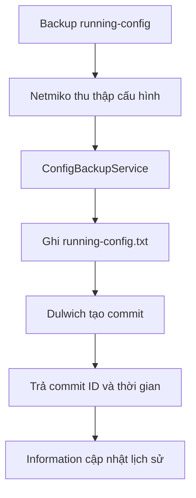

Tôi đã đối chiếu đúng mã nguồn tại commit `4197c1709be02fac978478c6eb71c437fd8140aa`. Phương án phù hợp nhất là tạo một Git repository độc lập bằng Dulwich cho từng thiết bị, không dùng Git CLI và không lưu lịch sử vào SQLite.

## 1. Cấu trúc đích

Hiện tại:

```text
app/
└── backup/
    └── 10.2.3.1/
        └── 10.2.3.1_running-config.txt
```

Sau khi tích hợp:

```text
app/
└── backup/
    └── 10.2.3.1/
        └── cfg/
            ├── .git/
            └── running-config.txt
```

Trong đó:

* `cfg/` là Git repository cục bộ.
* `running-config.txt` luôn chứa cấu hình mới nhất.
* Mỗi lần thu thập cấu hình thành công sẽ tạo một commit.
* Không cần remote, push hoặc tài khoản GitHub.
* Lịch sử cấu hình được lấy trực tiếp từ Git commit.
* Mỗi thiết bị có repository riêng, tránh lịch sử các host trộn lẫn nhau.

## 2. Phân tích luồng hiện tại

Tại snapshot này:

* [InformationView.qml](https://github.com/ntdatphu/CAMS/blob/4197c1709be02fac978478c6eb71c437fd8140aa/app/UI/qml/content/InformationView.qml) đang:

  * Chạy `show running-config` từ session đang mở.
  * Nếu không có session thì gọi `dbManager.getRunningConfigBackup(host)`.
  * Mới chỉ xem cấu hình hiện tại, chưa có danh sách lịch sử commit.

* [runtime.py](https://github.com/ntdatphu/CAMS/blob/4197c1709be02fac978478c6eb71c437fd8140aa/app/core/runtime.py) đang:

  * Dùng `saveRunningConfigBackup(host)`.
  * Tạo thư mục `backup/<host>`.
  * Gọi `connector.save_running_config(str(backup_dir))`.
  * Có sẵn worker bất đồng bộ `saveRunningConfigBackupAsync()`.

* [device_connector.py](https://github.com/ntdatphu/CAMS/blob/4197c1709be02fac978478c6eb71c437fd8140aa/app/infrastructure/network/device_connector.py) đang:

  * Chạy `show running-config`.
  * Ghi trực tiếp thành `<host>_running-config.txt`.
  * Sau đó đồng bộ interface và OSPF vào database.

* [pyproject.toml](https://github.com/ntdatphu/CAMS/blob/4197c1709be02fac978478c6eb71c437fd8140aa/app/pyproject.toml) chưa có dependency `dulwich`.

Điểm quan trọng: việc mở tab Information để xem trực tiếp không nên tự tạo commit. Commit chỉ nên sinh khi người dùng thực hiện chức năng Backup/Get running-config hoặc một tác vụ backup tự động sau này.

## 3. Kiến trúc đề xuất

Không nên đặt toàn bộ Dulwich trực tiếp trong `core/runtime.py`. Nên bổ sung feature riêng:

```text
app/
├── features/
│   └── config_backup/
│       ├── __init__.py
│       ├── paths.py
│       ├── repository.py
│       ├── service.py
│       ├── models.py
│       └── README.md
├── core/
│   ├── runtime.py
│   └── database.py
└── tests/
    ├── unit/
    │   └── test_config_backup_repository.py
    └── integration/
        └── test_config_backup_flow.py
```

Vai trò:

| File            | Trách nhiệm                                             |
| --------------- | ------------------------------------------------------- |
| `paths.py`      | Chuẩn hóa host và tạo đường dẫn `backup/<host>/cfg`     |
| `repository.py` | Thao tác Dulwich: init, commit, log, đọc blob           |
| `service.py`    | Điều phối lưu snapshot, migration và trả payload cho UI |
| `models.py`     | Kiểu dữ liệu commit/snapshot                            |
| `README.md`     | Giải thích cấu trúc, API, quy tắc commit và migration   |
| `runtime.py`    | Thu thập cấu hình thiết bị và gọi service               |
| `database.py`   | Cung cấp slot đọc cấu hình mới nhất/lịch sử cho QML     |

Luồng chính:



## 4. API backend cần xây dựng

### `ConfigBackupRepository`

Nên cung cấp các hàm:

```python
class ConfigBackupRepository:
    def ensure_repository(self, host: str) -> Path:
        ...

    def commit_snapshot(
        self,
        host: str,
        content: str,
        message: str | None = None,
    ) -> dict:
        ...

    def list_commits(
        self,
        host: str,
        limit: int = 100,
    ) -> list[dict]:
        ...

    def read_commit(
        self,
        host: str,
        commit_id: str,
    ) -> dict:
        ...

    def read_latest(self, host: str) -> dict:
        ...

    def restore_commit(
        self,
        host: str,
        commit_id: str,
    ) -> dict:
        ...
```

`restore_commit()` có thể triển khai ở giai đoạn sau. Giai đoạn đầu chỉ xem lịch sử, không sửa cấu hình thiết bị.

### Payload commit cho QML

```python
{
    "commitId": "3f8d91a...",
    "shortCommitId": "3f8d91a",
    "message": "20/07/2026 14:35:27",
    "timestamp": 1784532927,
    "dateTime": "20/07/2026 14:35:27",
    "author": "CAMS",
    "host": "10.2.3.1"
}
```

### Slot cho QML

Nên cung cấp qua `dbManager` hoặc context object mới `configBackupManager`:

```python
getLatestRunningConfig(host)
getRunningConfigHistory(host, limit)
getRunningConfigAtCommit(host, commit_id)
```

Kết quả đọc một commit:

```python
{
    "ok": True,
    "host": "10.2.3.1",
    "commitId": "3f8d91a...",
    "content": "...",
    "path": "backup/10.2.3.1/cfg/running-config.txt",
    "dateTime": "20/07/2026 14:35:27"
}
```

Tôi nghiêng về context object riêng `configBackupManager`, vì lịch sử cấu hình không phải nghiệp vụ database.

## 5. Quy tắc tạo commit

### Commit message

Theo yêu cầu ngày/tháng/năm và giờ 24 giờ:

```text
20/07/2026 14:35:27
```

Nên dùng múi giờ máy đang chạy ứng dụng và ghi timezone vào metadata commit. Không dùng tên chứa dấu `:` làm filename vì Windows không hỗ trợ, nhưng commit message dùng `:` bình thường.

### Author/committer

```text
CAMS <cams@localhost>
```

Có thể bổ sung hostname thiết bị vào message:

```text
20/07/2026 14:35:27 | 10.2.3.1
```

Tuy nhiên vì mỗi host đã có repository riêng, message chỉ chứa thời gian là đủ.

### Cấu hình không thay đổi

Có hai chính sách:

1. Chỉ commit khi nội dung thay đổi.
2. Mỗi lần backup thành công đều tạo commit, kể cả nội dung giống nhau.

Yêu cầu của bạn phù hợp với chính sách 2. Vì vậy repository phải hỗ trợ empty commit hoặc commit mới dùng cùng tree với commit trước. Điều này giúp lịch sử thể hiện chính xác mỗi lần thiết bị được thu thập cấu hình.

Nên thêm trường trong kết quả:

```python
{
    "changed": False,
    "commitCreated": True
}
```

UI có thể hiển thị “No configuration changes” cho commit có nội dung giống commit trước.

## 6. Thay đổi luồng lưu cấu hình

Hiện `DeviceConnector.save_running_config()` vừa lấy dữ liệu, vừa tự quyết định tên file. Nên tách thành:

```python
def collect_running_config(self) -> dict:
    return {
        "running_config": running_output,
        "interface_brief": brief_output,
    }
```

Sau đó `TerminalHelper.saveRunningConfigBackup()` thực hiện:

```python
snapshot = connector.collect_running_config()

result = config_backup_service.save_snapshot(
    host=host,
    content=snapshot["running_config"],
)

connector.sync_collected_state(
    snapshot["running_config"],
    snapshot["interface_brief"],
)
```

Lợi ích:

* Connector chỉ giao tiếp với thiết bị.
* Feature backup quyết định cách lưu và commit.
* Việc đồng bộ DB vẫn độc lập.
* Có thể unit test Dulwich mà không cần Cisco/EVE-NG.
* Sau này có thể backup từ file offline mà không cần Netmiko.

Thứ tự an toàn:

1. Thu thập toàn bộ cấu hình.
2. Kiểm tra output không rỗng và không phải thông báo lỗi.
3. Ghi file tạm.
4. Thay thế atomically thành `running-config.txt`.
5. Stage file.
6. Tạo commit.
7. Đồng bộ dữ liệu đã thu thập vào SQLite.
8. Trả kết quả cho UI.

Nếu commit thất bại, không báo backup thành công hoàn toàn.

## 7. Thiết kế tab Information

Giữ nguyên toàn bộ bố cục và thiết kế hiện tại của [InformationView.qml](https://github.com/ntdatphu/CAMS/blob/4197c1709be02fac978478c6eb71c437fd8140aa/app/UI/qml/content/InformationView.qml). Không thêm panel lịch sử và không chia lại vùng hiển thị.

Chỉ bổ sung một `ComboBox` cạnh nút `Reload`:

```text
┌────────────────────────────────────────────────────────────────────┐
│ Information                                                        │
│ 10.2.3.1 · backup/10.2.3.1/cfg/running-config.txt                 │
│                    [20/07/2026 14:35:27 ▼] [Reload] [Copy All]    │
├────────────────────────────────────────────────────────────────────┤
│                                                                    │
│                     Running configuration                          │
│                                                                    │
└────────────────────────────────────────────────────────────────────┘
```

### ComboBox lịch sử commit

* Đặt ngay bên trái nút `Reload`.
* Hiển thị các commit theo thứ tự mới nhất đến cũ nhất.
* Nội dung mỗi lựa chọn là thời gian commit theo định dạng 24 giờ:

```text
20/07/2026 14:35:27
20/07/2026 13:10:02
19/07/2026 21:42:11
```

* Có thể hiển thị thêm commit ID rút gọn để phân biệt:

```text
20/07/2026 14:35:27 · 3f8d91a
```

* Commit mới nhất được chọn mặc định.
* Giới hạn tải ban đầu khoảng 100 commit gần nhất.
* ComboBox bị vô hiệu hóa khi:

  * Chưa chọn thiết bị.
  * Thiết bị chưa có repository backup.
  * Repository chưa có commit.
  * Backend đang tải lịch sử hoặc nội dung.

### Khi chọn một commit

Ứng dụng gọi:

```python
configBackupManager.getRunningConfigAtCommit(host, commit_id)
```

Sau đó:

* Đọc `running-config.txt` trực tiếp từ Git object của commit.
* Hiển thị nội dung trong `ConfigTextViewer` hiện tại.
* Không checkout commit.
* Không thay đổi `cfg/running-config.txt`.
* Không tạo commit mới.
* Không gửi cấu hình xuống thiết bị.

Dòng nguồn phía trên hoặc trong `ConfigTextViewer` hiển thị:

```text
Running configuration · 20/07/2026 13:10:02 · 8a7c921
```

### Hành vi nút Reload

Khi nhấn `Reload`:

1. Tải lại danh sách commit của host hiện tại.
2. Chọn commit mới nhất, tức `HEAD`.
3. Đọc nội dung `running-config.txt` tại commit mới nhất.
4. Cập nhật `ComboBox` về phần tử đầu tiên.
5. Hiển thị cấu hình mới nhất trong `ConfigTextViewer`.

`Reload` chỉ tải lại dữ liệu từ repository backup:

* Không chạy `show running-config`.
* Không tạo commit.
* Không checkout.
* Không thay đổi repository.

### Khi chuyển thiết bị

Khi `currentHostIp` thay đổi:

1. Xóa nội dung và lịch sử của host cũ.
2. Tải danh sách commit của host mới.
3. Chọn commit mới nhất.
4. Hiển thị nội dung commit mới nhất.
5. Nếu chưa có backup, giữ nguyên thông báo trống hiện tại:

```text
No running-config data is available.
```

### Sau khi backup thành công

Khi nhận signal `runningConfigFinished(host, true, message)`:

* Nếu `host` đúng với thiết bị đang mở:

  * Tải lại danh sách commit.
  * Chọn commit mới nhất.
  * Hiển thị cấu hình vừa backup.
* Nếu là host khác, không thay đổi tab hiện tại.

### Thuộc tính QML cần bổ sung

```qml
property var commitHistory: []
property string selectedCommitId: ""
property bool isLoadingHistory: false
property bool isLoadingCommit: false
```

ComboBox dự kiến:

```qml
StandardComboBox {
    id: commitHistoryComboBox
    objectName: "informationCommitHistoryComboBox"

    Layout.preferredWidth: 240
    model: root.commitHistory
    textRole: "displayText"
    enabled: root.currentHostIp !== ""
             && count > 0
             && !root.isLoadingHistory
             && !root.isLoadingCommit

    onActivated: function(index) {
        root.loadCommit(model[index].commitId)
    }
}
```

Thứ tự các control:

```qml
StandardComboBox {
    // Lịch sử commit
}

StandardButton {
    // Reload — trở về commit mới nhất
}

StandardButton {
    // Copy All — giữ nguyên
}
```

Thiết kế này giữ nguyên giao diện Information hiện tại, đồng thời cho phép xem lịch sử mà không chiếm thêm không gian nội dung.

## 8. Migration dữ liệu hiện tại

Khi gặp:

```text
backup/10.2.3.1/10.2.3.1_running-config.txt
```

Migration thực hiện:

1. Kiểm tra và xác thực host.
2. Tạo `backup/10.2.3.1/cfg/`.
3. Khởi tạo repository Dulwich.
4. Chuyển nội dung file cũ thành:
   `cfg/running-config.txt`.
5. Tạo commit đầu tiên:

```text
Import legacy backup - 20/07/2026 14:35:27
```

6. Chỉ sau khi commit thành công mới xử lý file cũ.
7. Nên đổi tên file cũ thành:

```text
10.2.3.1_running-config.txt.migrated
```

8. Sau khi người dùng xác nhận hệ thống hoạt động ổn định mới xóa file `.migrated`.

Không nên xóa file cũ ngay trong lần chạy đầu tiên.

Migration phải có tính idempotent:

* Chạy nhiều lần không sinh commit import trùng.
* Repo đã có commit thì không import lại.
* Nếu migration bị gián đoạn, lần sau có thể tiếp tục an toàn.

## 9. Bảo vệ dữ liệu và đồng thời

Cần đặc biệt xử lý:

* Không cho host chứa `/`, `\`, `..` hoặc ký tự điều khiển.
* Với IPv6, đổi `:` thành `_` trong tên thư mục hoặc dùng mã hóa tên thư mục ổn định.
* Dùng lock riêng cho từng host vì worker có thể chạy đồng thời.
* Không để hai tiến trình ghi cùng `running-config.txt`.
* Ghi qua file tạm rồi dùng `os.replace()`.
* Không nhận `commit_id` tùy ý rồi dùng làm đường dẫn.
* Giới hạn lịch sử UI, ví dụ 100 commit mỗi lần.
* Không checkout commit khi chỉ xem.
* `backup/` tiếp tục nằm trong `.gitignore` của repository CAMS bên ngoài.
* Không đưa `.git` bên trong các thư mục backup lên repository mã nguồn chính.

## 10. Dependency

Bổ sung vào `app/pyproject.toml`:

```toml
"dulwich>=0.24,<0.26",
```

Nên khóa upper bound để tránh API thay đổi đột ngột. Sau khi chọn phiên bản thực tế, cập nhật lockfile của `uv`.

Không gọi:

```bash
git init
git add
git commit
```

Toàn bộ thao tác phải dùng API Dulwich để ứng dụng hoạt động ngay cả khi máy người dùng chưa cài Git.

## 11. Kế hoạch triển khai theo giai đoạn

### Giai đoạn 1 — Storage core

* Thêm Dulwich.
* Tạo `features/config_backup`.
* Khởi tạo repo theo host.
* Lưu `running-config.txt`.
* Tạo commit có thời gian 24 giờ.
* Đọc `HEAD`, lịch sử và nội dung blob.
* Viết unit test bằng thư mục tạm.

### Giai đoạn 2 — Tích hợp luồng backup

* Tách thu thập cấu hình khỏi ghi file trong `DeviceConnector`.
* Chuyển `saveRunningConfigBackup()` sang `ConfigBackupService`.
* Giữ nguyên đồng bộ interface/OSPF.
* Giữ worker async hiện có.
* Trả thêm `commitId`, `changed`, `dateTime`.

### Giai đoạn 3 — Migration

* Phát hiện file `<host>_running-config.txt`.
* Import thành commit đầu tiên.
* Giữ bản `.migrated`.
* Test migration chạy lặp lại.

### Giai đoạn 4 — Information UI

* Thêm panel lịch sử.
* Thêm API lấy danh sách commit.
* Chọn commit để xem nội dung.
* Phân biệt `Latest backup` và `Live configuration`.
* Refresh sau signal `runningConfigFinished`.

### Giai đoạn 5 — Kiểm thử và hoàn thiện

* Backup lần đầu.
* Backup nội dung thay đổi.
* Backup nội dung không thay đổi.
* Hai host backup đồng thời.
* Đọc commit cũ sau khi working tree thay đổi.
* Repo hỏng hoặc thiếu `HEAD`.
* Migration bị dừng giữa chừng.
* Host không hợp lệ.
* Unicode và line ending Windows/Linux.
* QML đổi host nhanh khi lịch sử đang tải.

## 12. Tiêu chí hoàn thành

Tính năng được xem là hoàn thành khi:

* `backup/<host>/cfg/.git` được tạo tự động.
* `cfg/running-config.txt` luôn là cấu hình mới nhất.
* Mỗi lần backup thành công có một commit mới.
* Commit message dùng giờ 24 giờ.
* Tab Information xem được tối thiểu 100 phiên bản gần nhất.
* Chọn commit cũ không làm thay đổi file hiện tại.
* Không cần cài Git CLI.
* File backup cũ được migration không mất dữ liệu.
* Backup của các host không ảnh hưởng lẫn nhau.
* Các thao tác mạng và đọc lịch sử không làm treo QML UI.
